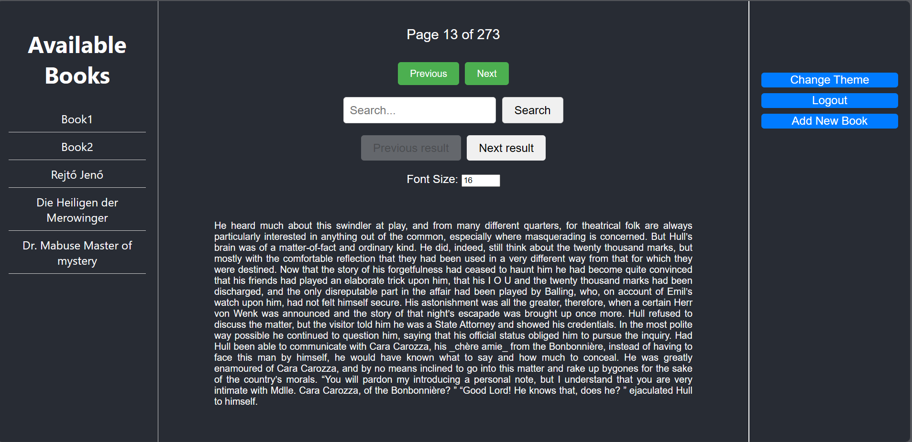
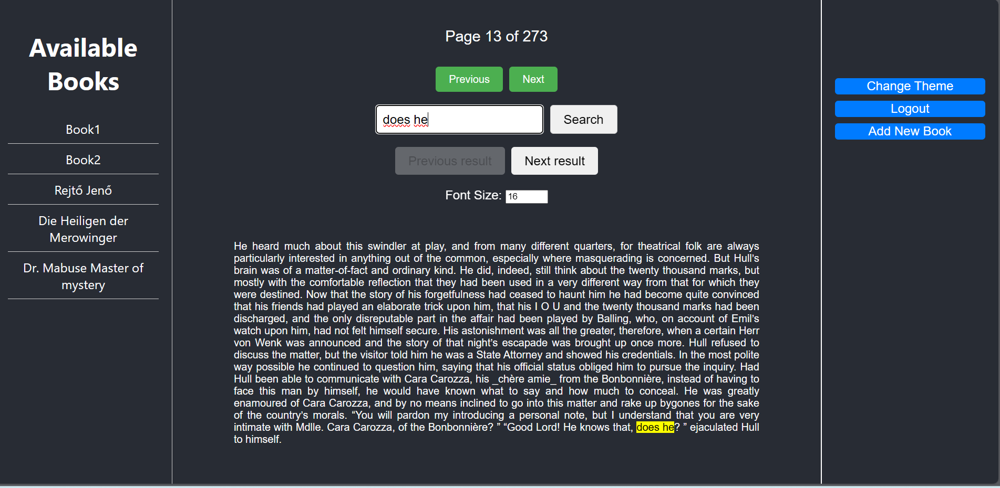
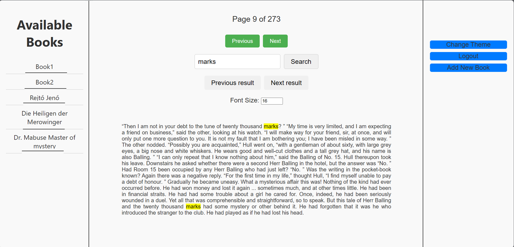

# E-Book Reader

## Projekt leírása

Ez a projekt egy egyszerű, frontend oldali **E-Book Reader** alkalmazás React keretrendszerrel.  
Az alkalmazás célja, hogy a felhasználók:

- Könyveket tölthessenek fel saját használatra
- Megnyithassák, olvashassák az e-könyveket
- Szövegméretet állíthassanak olvasás közben
- Kereshessenek a könyvek tartalmában
- Átválthassanak sötét és világos témák között a kényelmes olvasás érdekében

A projekt kizárólag frontend fejlesztés, backend szervert nem igényel.

## Fő funkciók

- 📚 Új könyv feltöltése (`.txt` fájlok támogatottak)
- 🔎 Szövegben keresés 
- 🔤 Szövegméret növelése / csökkentése
- 🌙 Sötét mód és ☀️ világos mód váltása
- 💾 Könyvek tárolása böngésző oldali IndexedDB adatbázisban

## Technológiák

- React 18 (TypeScript-tel)
- HTML5 / CSS3 (SASS lehetőséggel)
- LocalStorage és IndexedDB a böngészőben
- Alapértelmezett React Hooks (`useState`, `useEffect`)

## Képernyőképek

